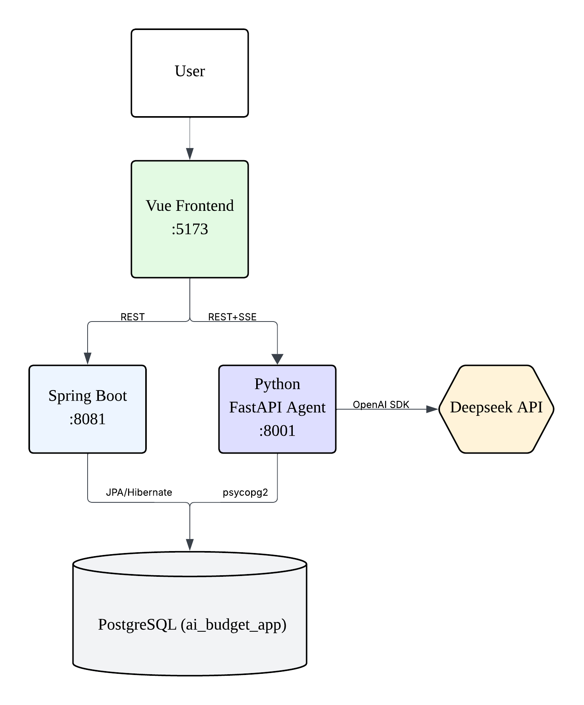

# Budget Agent

A Python FastAPI AI microservice that powers anomaly detection and conversational budget planning for a personal budget app.

🔗 **Related repos**: [budget-app-frontend](https://github.com/CoralZhu/budget-app-frontend) (Vue) · [budget-app-backend](https://github.com/CoralZhu/budget-app-backend) (Spring Boot)

🚀 **Live demo**: [budget-app-frontend-7x7q.onrender.com](https://budget-app-frontend-7x7q.onrender.com) — public demo with auto-injected guest token (AI features work; transactions CRUD requires Spring Boot backend, currently in roadmap)

📖 **API docs**: [budget-agent-oi5z.onrender.com/docs](https://budget-agent-oi5z.onrender.com/docs) — OpenAPI Swagger UI

📹 **Demo video**: Coming soon

> ⚠️ Render free tier wakes from sleep on first access. Initial load may take 30-60 seconds.

## Why this exists

Most budget apps can show charts, totals, and category breakdowns, but they struggle with personalized judgment. A fixed rule such as "alert when spending is over ¥100" is too blunt: ¥120 on groceries may be normal for one user and unusual for another. The anomaly detection agent solves this by querying the user's recent transactions and historical category baseline before deciding whether a purchase is actually unusual.

Budget planning has a different product problem. Manually creating a monthly budget requires looking at historical spending, income, existing budgets, current-month spending, and personal saving goals. Users often know what they want in natural language: "I want to save ¥1,000 next month, but keep food flexible." The budget planning agent turns that conversation into a data-backed budget proposal.

Both workflows require tool use and an iterative reasoning loop. The service is therefore implemented as agents with database tools, not as a single prompt over static text.

## Features

- ReAct-style anomaly detection over the last 7 days of transactions.
- Personalized category baselines using historical daily averages.
- Strict JSON output for frontend rendering of anomaly cards.
- `transaction_id` in each anomaly for frontend deduplication.
- Multi-turn budget planning with conversation history.
- Human-in-the-loop confirmation before writing budgets to the database.
- Server-Sent Events streaming for budget planning responses.
- Conversation persistence through `conversations` and `conversation_messages` tables.
- FastAPI wrapper with 6 HTTP endpoints and OpenAPI docs.

## Architecture diagram



## The two agents

### Anomaly Detection Agent

The anomaly detection agent checks whether recent spending deviates from the user's own historical behavior. It is designed for lightweight usage, such as running when the user opens the budget app home page.

The ReAct loop follows four steps:

1. Query recent expense transactions, usually the last 7 days.
2. Extract the categories that appear in those transactions.
3. Query the historical daily average for each category.
4. Mark a transaction as anomalous when `amount > category_daily_average * 2`.

Example response:

```json
{
  "has_anomaly": true,
  "anomalies": [
    {
      "transaction_id": 67,
      "amount": 124.6,
      "category": "购物",
      "merchant": "化妆品",
      "baseline": 21.02,
      "ratio": 5.9,
      "reason": "Purchase of ¥124.6 is 5.9× the user's daily average for 购物 (¥21.02), exceeding the 2× anomaly threshold."
    }
  ],
  "summary": "One unusual transaction was found in the last 7 days."
}
```

Two design choices matter here. First, the API asks the model for structured JSON and also uses `response_format={"type": "json_object"}` to reduce parsing failures. Second, each anomaly includes `transaction_id`, which lets the frontend store dismissed alerts in `localStorage` and avoid showing the same card repeatedly.

### Budget Planning Agent

The budget planning agent is a multi-turn assistant for creating or adjusting monthly budgets. It accepts natural language goals, gathers financial context through tools, proposes a budget, lets the user revise it, and writes the final plan only after explicit confirmation.

The workflow is:

1. Ask which month the user wants to plan and whether they have a saving goal.
2. Query historical monthly averages by category.
3. Query income for the target month.
4. Query any existing budget for the target month.
5. Optionally query current-month spending by category.
6. Generate a proposed total budget and category budgets.
7. Ask the user to accept, revise, or confirm the plan.

The write path uses a dual-layer human-in-the-loop guardrail. At the LLM layer, the system prompt says `save_budget_plan` may only be called after the user clearly says words like "confirm", "save", "write", or "looks good". At the code layer, `execute_budget_tool` checks the latest user message before executing `save_budget_plan`; if the confirmation keywords are absent or negated, the function refuses to write to the database. This treats the prompt as guidance and the code as the enforcement boundary.

Streaming is implemented with a two-stage ReAct loop. Tool-call decisions are made with normal, non-streaming completions because function call arguments are structured and harder to assemble from streamed deltas. Once the model reaches the final natural-language response, the service makes a second call with `stream=True` and forwards text chunks to the frontend through Server-Sent Events.

Conversation history is persisted in PostgreSQL. The frontend can pass a `conversation_id`; the API loads stored messages, appends the latest user message, runs the agent, then saves new messages back to the database. This allows the user to continue a planning session from where they left off.

## Tech stack

| Layer | Technology |
| --- | --- |
| Language | Python 3.11 |
| API framework | FastAPI |
| LLM client | OpenAI Python SDK |
| LLM provider | DeepSeek API (`deepseek-chat`) |
| Database | PostgreSQL (`ai_budget_app`) |
| Database driver | psycopg2 |
| Configuration | python-dotenv |
| Streaming | Server-Sent Events via `StreamingResponse` |
| Frontend integration | Vue dev server on port 5173 |
| Backend integration | Spring Boot CRUD service on port 8081 |

## API endpoints

OpenAPI documentation is available at `http://localhost:8001/docs`.

- `POST /api/agent/anomaly-check` - Runs anomaly detection and returns a single JSON response.
- `GET /api/agent/budget/start` - Starts a new budget-planning conversation and returns the opening assistant message.
- `POST /api/agent/budget/chat` - Runs one non-streaming budget-planning turn; kept as a fallback and Swagger-friendly demo endpoint.
- `POST /api/agent/budget/chat/stream` - Runs one streaming budget-planning turn with SSE events.
- `GET /api/agent/conversations` - Lists a user's persisted agent conversations.
- `GET /api/agent/conversations/{id}` - Returns full message history for one conversation.

## Setup

Prerequisites:

- Python 3.11
- PostgreSQL with the `ai_budget_app` database
- A DeepSeek API key

Install dependencies:

```bash
cd /path/to/budget-agent
python3.11 -m venv venv
source venv/bin/activate
pip install fastapi uvicorn openai psycopg2-binary python-dotenv
```

Create `.env`:

```env
DEEPSEEK_API_KEY=your_deepseek_api_key_here

DB_HOST=localhost
DB_PORT=5432
DB_NAME=ai_budget_app
DB_USER=your_db_user
DB_PASSWORD=your_db_password
```

Start the API service:

```bash
python api.py
```

The service runs on `http://localhost:8001`.

Test anomaly detection:

```bash
curl -X POST http://localhost:8001/api/agent/anomaly-check \
  -H "Content-Type: application/json" \
  -d '{"user_id":1,"days":7}'
```

Start a budget conversation:

```bash
curl "http://localhost:8001/api/agent/budget/start?user_id=1"
```

Test streaming budget chat:

```bash
curl --no-buffer -X POST http://localhost:8001/api/agent/budget/chat/stream \
  -H "Content-Type: application/json" \
  -d '{
    "user_id": 1,
    "messages": [
      {"role": "user", "content": "I want to plan my 2026-06 budget and save 1000 yuan."}
    ]
  }'
```

## Project structure

```text
budget-agent/
├── api.py              # FastAPI wrapper exposing agent endpoints
├── agent.py            # CLI anomaly detection agent and ReAct loop
├── budget_planner.py   # CLI multi-turn budget planner with HITL guardrail
├── db.py               # Database tools and conversation persistence helpers
├── README.md
├── .env                # Local secrets and database configuration (gitignored)
└── venv/               # Local Python virtual environment (gitignored)
```

## Design decisions

The agents use hand-written ReAct loops instead of LangChain or LangGraph. The goal is transparency: every model call, tool call, tool result, and message append is visible in ordinary Python. That makes the service easier to debug, easier to explain, and easier to modify while learning AI agent engineering.

The AI layer is a separate Python service rather than part of the Spring Boot backend. This keeps the CRUD backend focused on conventional application logic while letting the agent service use Python's LLM and data tooling ecosystem. It also allows the AI service to be deployed, scaled, and iterated independently.

The non-streaming budget endpoint remains even though the frontend normally uses SSE. It gives Swagger UI a simple demo path, provides a fallback for clients that do not support streaming, and helps isolate whether a bug is in model reasoning or streaming transport.

The budget write guardrail is implemented twice because prompts are not enforcement. The model is instructed not to call `save_budget_plan` until the user confirms, but the Python tool executor also checks the latest user message before writing. If the model makes a premature tool call, the code rejects it.

## What's next

- JWT authentication; currently `user_id` is passed in request bodies or query parameters.
- Cloud deployment for the FastAPI service and PostgreSQL connection management.
- Streaming support for anomaly detection if the product needs progress indicators.
- More agents, such as monthly recap generation and OCR result categorization.
- Long-term memory beyond raw conversation history.
- Better evaluation fixtures for tool-calling behavior and HITL refusal cases.

## Acknowledgements / License

Built with DeepSeek API, FastAPI, and PostgreSQL. No formal license has been selected yet.
